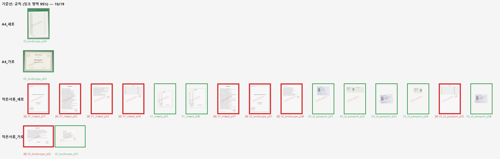
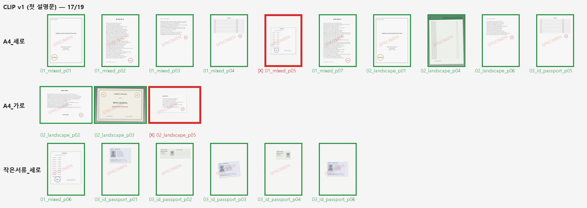
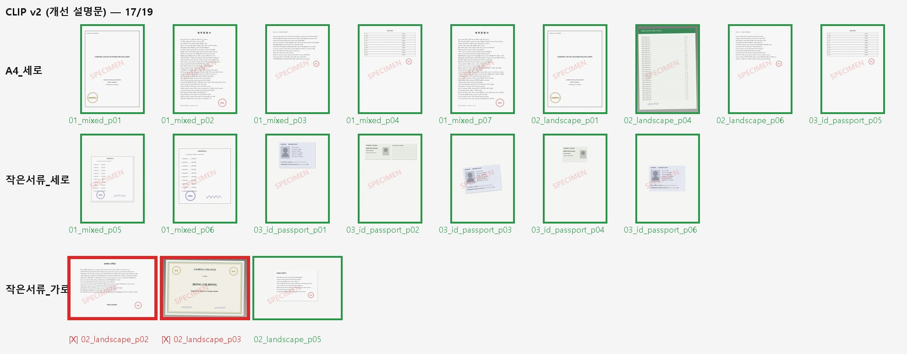

# 개선 효과 검증

실행일: 2026-09-24

두 묶음의 자료로 검증했다.

| 자료 | 장수 | 작은 서류 | 공개 여부 | 실행 환경 |
|---|---|---|---|---|
| **가짜 샘플** [`data/samples/`](../data/samples/) | 19쪽 (PDF 3개) | 8장 (A5 1장 포함) | 공개 | Colab T4, 로컬 CPU (결과 동일) |
| **실제 서류** (업무 완료 서류 PDF 2개) | 26쪽 | 2장 (A5 1장 포함) | **비공개** | 로컬 CPU 만 |

가짜 샘플은 실제 서류의 구성(세로 인증서, 가로 졸업장, 회색 배경 사진, 작은 아포스티유, A5 페이지)을 본떠
[`data/make_samples.py`](../data/make_samples.py) 로 만들었고, 실제 서류에 드물었던 여권·신분증 페이지를 보충했다.
**가짜 샘플로 방법을 정하고, 실제 서류는 확인용으로만 썼다.**

---

## 1. 결과 요약

### 가짜 샘플 19쪽

| | 규칙 (95%) | CLIP v1 | CLIP v2 |
|---|---|---|---|
| 가로/세로 | 19/19 | 19/19 | 19/19 |
| **폴더까지 정확** | 10/19 (53%) | **17/19 (89.5%)** | **17/19 (89.5%)** |
| 작은 서류 잡아냄 | 8/8 | 6/8 | **8/8** |
| A4 를 작은 서류로 잘못 보냄 | 9장 | **0장** | 2장 |
| 참고: "전부 A4" 라고 하면 | 12/19 | | |

### 실제 서류 26쪽

| | 규칙 (95%) | CLIP v1 | CLIP v2 |
|---|---|---|---|
| 가로/세로 | 26/26 | 26/26 | 26/26 |
| **폴더까지 정확** | 2/26 (8%) | 23/26 (88.5%) | **25/26 (96.2%)** |
| 작은 서류 잡아냄 | 2/2 | 1/2 | **2/2** |
| A4 를 작은 서류로 잘못 보냄 | 24장 | 2장 | 1장 |
| 참고: "전부 A4" 라고 하면 | 25/26, 작은 서류 1/2 | | |

### 성공 기준 판정

| 기준 | 결과 | 판정 |
|---|---|---|
| **A. 정확도 90% 이상** | 실제 서류 v2 **96.2%** / 가짜 샘플 v2 89.5% | 실제 서류 **통과**, 가짜 샘플은 1장 차이로 미달 |
| **B. 작은 서류를 놓치지 않음** | v2 는 두 자료 모두 작은 서류 **전부** 잡아냄 | **통과** |
| **C. 수작업보다 빠름** | 14쪽 PDF 기준 약 **16초** vs 수작업 약 **2분** | **통과** (검수 시간 제외) |

**정직하게 짚을 점:** 실제 서류는 작은 서류가 2장뿐이라 "전부 A4" 라고만 해도 25/26 이 나온다.
그래서 실제 서류의 96.2% 는 숫자만으로는 인상적이지 않다. 차이는 **무엇을 틀리느냐**에 있다.
"전부 A4" 는 A4 위 아포스티유를 놓치고, CLIP v2 는 그것을 잡는 대신 가로 졸업장 1장을 작은 서류로 보낸다.
작은 서류가 많은 가짜 샘플에서는 "전부 A4" 가 12/19, CLIP 이 17/19 로 차이가 분명하다.

---

## 2. 규칙이 실패한 이유 — 종이 경계가 보이지 않는다

흰 종이를 흰 스캐너에 올리면 종이와 배경의 경계가 없다. 그래서 규칙은 **종이 크기가 아니라 글자·테두리 영역**을
잰다. A4 서류도 여백이 있어서 글자 영역은 대개 페이지의 75~90% 이고, 내용이 짧으면 40%대까지 내려간다.
실제 A4 서류 24장 중 가로·세로 모두 95% 를 넘은 것은 하나도 없었다 (가장 큰 것이 0.953×0.949). 그래서 95% 기준을 그대로 쓰면 A4 서류가 거의
전부 작은 서류로 간다 (실제 서류 24장 오분류).

정답을 보고 기준값을 가장 유리하게 골라도 해결되지 않는다. 실제 서류의 글자 영역 비율(짧은 쪽):

```
A4 서류   0.429  0.437  0.489  0.583  0.737 ... 0.949    ← 내용이 위쪽뿐인 A4 서류가 0.43~0.58
작은 서류 0.505                                            ← A4 위 아포스티유
```

작은 서류(0.505)가 A4 서류들 사이에 끼어 있어서 **어떤 기준값으로도 가를 수 없다.** 가짜 샘플에서도 같은
현상이 나타났다 (가장 좋은 기준에서도 2장 틀림).



## 3. CLIP v1 — 여권·신분증은 잡고, "서류처럼 생긴 작은 종이"는 놓친다



- 규칙이 틀린 **"내용이 위쪽뿐인 A4 서류"를 모두 A4 로 맞혔다.** A4 서류를 작은 서류로 보낸 경우가 0장.
- **여권·신분증 5장 전부**를 작은 서류로 맞혔다. 기울어진 여권, 가장자리 그림자가 없는 신분증도 포함.
- **틀린 2장**은 A4 위 작은 아포스티유(`01_mixed_p05`)와 가로 A4 위 작은 확인서(`02_landscape_p05`).
  둘 다 작은 종이 자체가 **글자가 적힌 서류**다. v1 의 "작은 것" 설명문이 여권·신분증 위주라서, 작은 서류를
  "서류 한 장" 쪽으로 판단했다.
- 실제 서류에서도 **같은 유형**을 틀렸다: A4 위 아포스티유(qnet p06, p_small 0.378). 추가로 내용이 위쪽 절반뿐인
  증명서 뒷장 2장(qnet p03, p10)을 기준 0.5 를 간신히 넘겨(0.554, 0.548) 작은 서류로 보냈다.

## 4. CLIP v2 — 설명문 보강 후



v1 의 가짜 샘플 실패 2건만 보고 설명문 3개를 추가했다 ("넓은 빈 페이지 가운데 놓인 테두리 있는 작은 증명서",
"사방에 넓은 여백이 있는 작은 서식", "위쪽에 글자가 있고 아래가 빈 서류 페이지").

- 가짜 샘플: 작은 아포스티유·확인서를 이제 잡는다 (작은 서류 8/8). **대신 가로 졸업장 2장을 작은 서류로 보냈다.**
  맞힌 수는 17/19 로 v1 과 같다.
- 실제 서류 (v2 확정 후 1회만 실행): **25/26**. 아포스티유를 잡았고(0.580), 증명서 뒷장 2장도 A4 로 돌아왔다.
  **남은 실패 1장은 회색 배경 위 가로 졸업장 원본**(가로샘플 p03, p_small 0.919).

### 실패 사례 — 회색 배경 위 장식 테두리 졸업장

가짜 샘플의 `02_landscape_p03` 과 실제 서류의 가로샘플 p03 이 **같은 이유로** 틀렸다. 장식 테두리가 있는
졸업장이 회색 배경 위에 놓인 사진은, 72dpi 로 줄이면 "넓은 여백 가운데 테두리 있는 작은 증명서" 와 비슷해 보인다.
v2 에서 추가한 설명문이 바로 그 모습을 묘사하므로, 한쪽을 고치자 다른 쪽이 깨졌다.

가짜 샘플에서 이 약점이 **실제 서류보다 먼저** 드러났다는 점이 의미 있다. 가짜 샘플이 실제 서류의 성질을
재현하고 있다는 근거이기도 하다.

실제 서류 결과를 본 뒤에는 설명문을 고치지 않았다. 고치면 이 1장은 맞힐 수 있겠지만, 그것은 확인용 자료에
맞춘 것이 되어 새 서류에서 같은 정확도를 기대할 근거가 사라진다.

---

## 5. 시간

| | 14쪽 PDF 1개 | 비고 |
|---|---|---|
| 수작업 | 약 **120초** | 사용자 평소 작업 시간 |
| 도구 (로컬 CPU) | 약 **16초** | 모델 준비 약 15초 + 페이지 처리 약 1.2초 |
| 도구 (Colab T4, 첫 실행) | 약 55초 | 모델 내려받기 포함 |

실제 서류 26쪽을 처리한 시간은 모델 준비 14.5초 + 페이지 처리 2.3초(판정 + 200dpi JPG 저장)였다.
모델 준비는 실행할 때마다 한 번이므로 **PDF 를 여러 개 한 번에 돌릴수록 이득이 커진다.**

다만 도구가 틀린 1~2장을 찾는 검수 시간은 포함하지 않았다. 폴더별로 썸네일을 훑어보는 데 몇 초면 되지만
재지는 않았다. 수작업이 이미 2분으로 빠른 편이라, 이 단계만으로 얻는 시간 이득은 PDF 하나에 1분 남짓이다.
실제로 큰 이득은 다음 단계인 **개인정보 마스킹**에 있다 (→ [`04_limits_next.md`](04_limits_next.md)).

---

## 6. 페이지별 결과 (실제 서류)

실제 서류 이미지는 공개하지 않고, 페이지별 판정 값만 남긴다. (p_small: CLIP 이 "작은 서류" 쪽이라고 본 확률)

| PDF | 쪽 | 정답 | 규칙 (글자 영역 가로×세로) | CLIP v1 | CLIP v2 |
|---|---|---|---|---|---|
| qnet | 1 | A4 세로 | 0.90×0.91 ✗ | 0.001 | 0.206 |
| qnet | 2 | A4 세로 | 0.74×0.78 ✗ | 0.097 | 0.071 |
| qnet | 3 | A4 세로 (내용 위쪽만) | 0.77×0.49 ✗ | 0.554 ✗ | 0.451 |
| qnet | 4 | A4 세로 (표만) | 0.76×0.58 ✗ | 0.059 | 0.068 |
| qnet | 5 | A4 세로 | 0.88×0.90 ✗ | 0.025 | 0.222 |
| qnet | 6 | **작은 서류 세로 (A4 위 아포스티유)** | 0.73×0.51 | 0.378 ✗ | 0.580 |
| qnet | 7 | A4 세로 | 0.90×0.89 ✗ | 0.036 | 0.256 |
| qnet | 8 | A4 세로 | 0.90×0.91 ✗ | 0.000 | 0.170 |
| qnet | 9 | A4 세로 | 0.76×0.81 ✗ | 0.134 | 0.129 |
| qnet | 10 | A4 세로 (내용 위쪽만) | 0.73×0.44 ✗ | 0.548 ✗ | 0.275 |
| qnet | 11 | A4 세로 (표만) | 0.76×0.43 ✗ | 0.099 | 0.096 |
| qnet | 12 | A4 세로 | 0.95×0.95 ✗ | 0.037 | 0.082 |
| qnet | 13 | **작은 서류 세로 (A5 페이지)** | 페이지 크기로 판정 ✓ | 페이지 크기로 판정 ✓ | 페이지 크기로 판정 ✓ |
| qnet | 14 | A4 세로 | 0.90×0.89 ✗ | 0.091 | 0.319 |
| 가로샘플 | 1 | A4 세로 | 0.90×0.91 ✗ | 0.001 | 0.258 |
| 가로샘플 | 2 | A4 가로 | 0.80×0.77 ✗ | 0.284 | 0.427 |
| 가로샘플 | 3 | A4 가로 (회색 배경 졸업장) | 0.83×0.85 ✗ | 0.002 | 0.919 ✗ |
| 가로샘플 | 4 | A4 세로 | 0.90×0.89 ✗ | 0.082 | 0.363 |
| 가로샘플 | 5 | A4 세로 | 0.90×0.91 ✗ | 0.002 | 0.355 |
| 가로샘플 | 6 | A4 세로 | 0.87×0.89 ✗ | 0.011 | 0.034 |
| 가로샘플 | 7 | A4 세로 | 0.86×0.89 ✗ | 0.018 | 0.045 |
| 가로샘플 | 8 | A4 세로 | 0.87×0.89 ✗ | 0.048 | 0.063 |
| 가로샘플 | 9 | A4 세로 | 0.86×0.89 ✗ | 0.046 | 0.261 |
| 가로샘플 | 10 | A4 세로 (회색 배경 사진) | 0.89×0.90 ✗ | 0.038 | 0.095 |
| 가로샘플 | 11 | A4 세로 (회색 배경 사진) | 0.84×0.90 ✗ | 0.027 | 0.083 |
| 가로샘플 | 12 | A4 세로 | 0.90×0.89 ✗ | 0.140 | 0.303 |

(✗ = 틀림. CLIP 은 p_small ≥ 0.5 이면 작은 서류)

## 7. 재현

```bash
python poc/split_pdf.py --pdfs data/samples --backend rule --run-id run1
python poc/split_pdf.py --pdfs data/samples --backend clip --clip-prompts v1 --run-id run1
python poc/split_pdf.py --pdfs data/samples --backend clip --clip-prompts v2 --run-id run2
python poc/score.py --truth data/ground_truth.csv --pred outputs/run2/clip/predictions.csv --sweep
```

채점 결과 원문: `outputs/run1/rule/score.txt`, `outputs/run1/clip/score.txt`, `outputs/run2/clip/score.txt`
